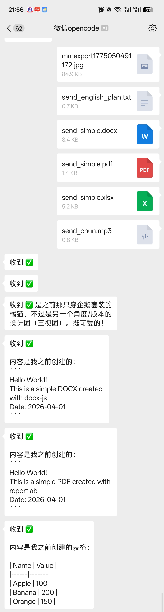
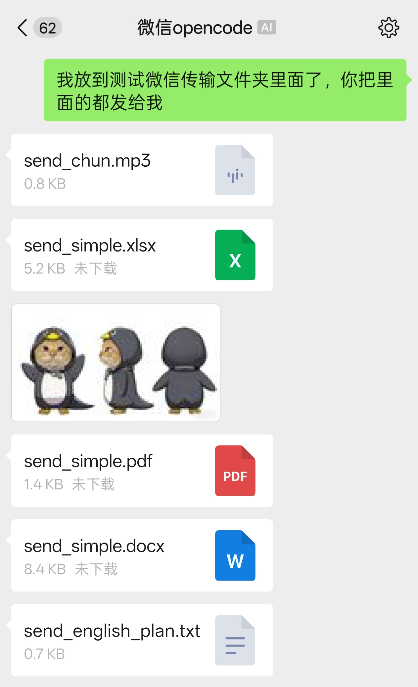

# WeChat OpenCode

[🇨🇳 中文](README_zh.md) | [🇬🇧 English](README.md)

Bridge WeChat direct messages to OpenCode, with full bidirectional support for text, images, files, audio, and video.

 

## Features

- **Text** — Send/receive messages between WeChat and OpenCode
- **Images** — Send/receive images with WeChat CDN support
- **Files** — Send/receive files of any type
- **Audio/Video** — Full audio and video message support
- **QR Login** — Terminal QR code rendering for WeChat login
- **One Session Per User** — Dedicated ACP session for each WeChat user
- **Daemon Mode** — Run in background with `--daemon`
- **send-wechat Tool** — Agents can send files/images back to WeChat

## Install

```bash
npx wechat-bridge-opencode --agent opencode
```

Or install globally:

```bash
npm install -g wechat-bridge-opencode
wbo --agent opencode
```

## Usage

```bash
cd /path/to/your/project
npx wechat-bridge-opencode --agent opencode
```

First run will:
1. Show QR code in terminal
2. Save login token to `~/.wechat-bridge-opencode`
3. Start polling WeChat DMs

## Options

| Flag | Description |
|------|-------------|
| `--agent <preset\|cmd>` | Built-in preset or raw command |
| `--cwd <dir>` | Working directory |
| `--login` | Force re-login |
| `--daemon` | Run in background |
| `--config <file>` | JSON config file |
| `--idle-timeout <min>` | Session idle timeout (default: 1440, 0 = unlimited) |
| `--max-sessions <count>` | Max concurrent sessions (default: 10) |
| `--show-thoughts` | Forward agent thinking to WeChat |

## WeChat Commands

### Workspace (`/workspace` or `/ws`)

| Command | Description |
|---------|-------------|
| `/workspace list` | List all directories |
| `/workspace switch <n\|path>` | Switch directory |
| `/workspace add /path [name]` | Add directory |
| `/workspace status` | Show current directory |

### Session (`/session` or `/s`)

| Command | Description |
|---------|-------------|
| `/session list` | List recent 10 sessions |
| `/session switch <n\|slug>` | Switch session |
| `/session new` | New session (clear context) |
| `/session status` | Show current session |

## Requirements

- Node.js 20+
- WeChat iLink bot API access
- [OpenCode](https://github.com/anomalyco/opencode) installed locally or via npx

## Storage

Runtime data stored in `~/.wechat-bridge-opencode`:
- Login token
- Auth tokens
- Temp files (downloaded media)
- Daemon PID / log
- Bridge state (`.wechat-bridge-state.json`)

## Notes

- Direct messages only (group chats ignored)
- Permission requests are auto-approved
- `send-wechat` tool auto-installed to `~/.config/opencode/tools/send-wechat.ts`

## License

MIT
