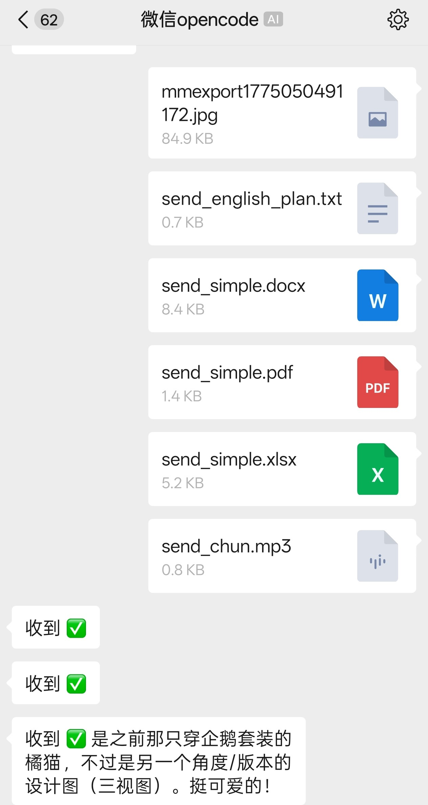
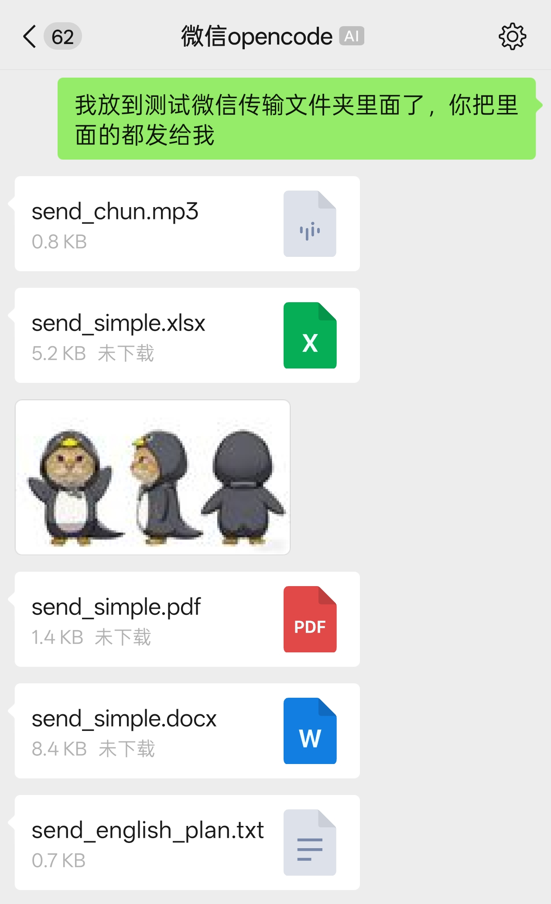

# WeChat OpenCode

[中文](README.md) | [English](README.en.md)


将微信私聊消息桥接到 OpenCode，支持文本、图片、文件、音视频的双向传输。目标是在微信端还原 OpenCode TUI 和 Desktop 的体验。

 

## 功能

- **发送** — 文本、图片、文件、音视频从微信发送给 OpenCode agent；媒体自动下载到 `~/.wechat-bridge-opencode/tempfile/`，本地路径作为附件发给 agent
- **接收** — OpenCode agent 回复文本到微信，或通过 `send-wechat` 工具主动推送文字、文件、图片到微信
- **微信 slash 命令** — `/help`、`/workspace`、`/session`、`/agent`、`/model`、`/stop`、`/compact`、`/history`、`/silent` 等 18+ 条命令由 bridge 直接处理，不进入 agent
- **OpenCode slash 命令** — bridge 不识别的 `/xxx` 自动作为文本转发给 agent，触发 OpenCode 内置 slash 命令（如 `/init`、`/review`）；发送 `/help` 可查看所有可触发指令
- **LLM 问答支持** — 转发 OpenCode `question` 工具的提问到微信，支持选项 / 多选 / 自定义答案；30 分钟软超时自动 reject
- **工具权限审批** — WeChat 弹权限卡片，支持 `once` / `always` / `reject` 三选一；`/auto-permission` 可切换自动接收模式；30 分钟软超时自动 reject
- **静默模式** — 启用 `/silent`（别名 `/sl`）后，一轮 turn 中只发送最终文本回复；推理、工具摘要、增量文本在 turn 结束前隐藏。Question / Permission 请求不受影响；设置独立且跨重启持久化
- **跨会话通知** — 其他 session 的 question/permission/error/completion 事件推送到微信；切换到有 pending 的会话自动弹出卡片
- **二维码登录** — 终端渲染二维码，扫码登录微信
- **OpenCode Server** — 基于 HTTP API，不再需要 ACP 子进程

## 安装与使用

### 方式一：npx（无需安装，推荐）
在项目目录直接运行即可：
```bash
cd /path/to/your/project
npx wechat-bridge-opencode
```

### 方式二：全局安装
```bash
npm install -g wechat-bridge-opencode
```
安装完成后可在任意项目目录使用简写命令：
```bash
cd /path/to/your/project
wbo
```

首次运行会：
1. 自动启动 `opencode serve`（HTTP Server）
2. 终端显示二维码
3. 扫码登录微信
4. 保存登录令牌到 `~/.wechat-bridge-opencode`
5. 开始轮询微信私信

## 选项

| 参数 | 说明 |
|------|------|
| `--cwd <目录>` | 工作目录 |
| `--server-url <url>` | 连接外部 OpenCode Server，跳过自动启动 |
| `--server-username <user>` | 外部 Server 的 HTTP Basic 用户名（与 `--server-password` 配合） |
| `--server-password <pwd>` | 外部 Server 的 HTTP Basic 密码 |
| `--server-token <token>` | 外部 Server 的 Bearer Token（优先级高于 Basic） |
| `--login` | 强制重新登录 |
| `--daemon` | 后台运行 |
| `--config <文件>` | JSON 配置文件 |

**外部 Server 认证**

当 `--server-url` 指向需要认证的 server 时，bridge 会自动注入 `Authorization` 头。支持两种方式（独立配置，Bearer 优先）：

- **Basic 认证**：`--server-username` + `--server-password` 同时使用，常见于 nginx/caddy 反向代理内置认证
- **Bearer Token**：`--server-token <token>`，常见于 API key / 自定义认证中间件

为避免敏感信息落入 shell history 或 JSON 配置文件，也可通过环境变量设置（**优先级：CLI > 环境变量 > 配置文件**）：

```bash
export WECHAT_OPENCODE_SERVER_TOKEN=xxx
export WECHAT_OPENCODE_SERVER_USERNAME=admin
export WECHAT_OPENCODE_SERVER_PASSWORD=secret
```

> Basic 认证要求用户名和密码**同时**配置；只设一个会启动失败并报错。Bearer Token 与 Basic 同时配置时，Token 生效。`password` / `token` 视为敏感字段，永远不会写入日志或 `/status` 命令的输出。

**启动超时**

sidecar 模式下 bridge 会等待 `opencode serve` 就绪后再继续（避免后续 session 创建因 server 还没监听而失败）。默认 180 秒（3 分钟），足以覆盖首次 `npx opencode-ai` 安装时 npx 下载包的时间；暖启动通常 <1s。如需调整：

```bash
export WECHAT_OPENCODE_STARTUP_TIMEOUT_MS=300000   # 5 分钟
export WECHAT_OPENCODE_STARTUP_TIMEOUT_MS=600000   # 10 分钟（极慢网络）
```

合法值：非负整数（毫秒）。`0` 表示立即失败（用于测试）；非数字或负数会报警告并回退到默认值。等待超过 20 秒时日志会每 20 秒输出一次进度提示（含 npx 下载提示），方便管理员识别首次安装场景。

## 微信命令

### 帮助（`/help`）

| 命令 | 说明 |
|------|------|
| `/help`（`/h`、`/?`） | 显示所有可用命令的帮助信息 |

### 状态（`/status`）

| 命令 | 说明 |
|------|------|
| `/status` | 显示当前会话（含标题）、工作区、Agent、Model、推理级别、上下文用量，**agent 状态**（busy/idle/retry，由 SSE `session.status` 事件驱动），**其他正在运行的会话数**（server-wide root 会话，排除当前会话和子 agent 会话），以及 **MCP servers 状态**（含失败原因）。Agent/Model/Reasoning/MCP 通过 OpenCode Server 的 HTTP API 拉取（按当前工作区 `?directory=...` 限定，切换工作区时自动刷新）；空会话时 Model 取 server 配置中工作区的 `model:` 字段 |

### 工作区（`/workspace` 或 `/ws`）

| 命令 | 说明 |
|------|------|
| `/workspace list` | 列出所有工作区，按最近活跃度排序，带序号 |
| `/workspace status` | 显示当前工作区 |
| `/workspace switch <路径\|编号>` | 切换到指定目录（`/workspace list` 中的编号也可）；恢复该目录下最近的会话（无则新建） |
| `/workspace add <路径>` | 添加并切换到目录 |

### 会话（`/session` 或 `/s`）

| 命令 | 说明 |
|------|------|
| `/session list` | 列出最近 20 个会话，显示工作路径 |
| `/session list current` | 列出当前工作区的最近 20 个会话 |
| `/session switch <n>` | 按编号切换到指定会话（自动切换到对应工作区） |
| `/session new` | 新会话（清除上下文） |
| `/session status` | 显示当前会话信息 |

### Agent（`/agent` 或 `/a`）

| 命令 | 说明 |
|------|------|
| `/agent list` | 列出可用 Agent 模式，带序号和当前标记（仅显示 primary 非内置 agent） |
| `/agent switch <名称\|n>` | 按名称或序号切换 Agent 模式 |
| `/agent status` | 显示当前 Agent 模式 |

### Model（`/model`）

| 命令 | 说明 |
|------|------|
| `/model list` | 列出模型提供商及其数量 |
| `/model list <provider>` | 列出指定提供商下的所有模型 |
| `/model switch <provider/model>` | 切换模型（如 anthropic/claude-sonnet-4-5） |
| `/model status` | 显示当前模型 |

### Reasoning（`/reasoning`）

| 命令 | 说明 |
|------|------|
| `/reasoning list` | 列出当前模型支持的实际推理等级（从模型 variants 获取），并在首位显示一个合成的 `Default` 选项（对齐 OpenCode TUI 行为）；选择它（或 `/reasoning switch default`）会将 `currentReasoning` 设为 undefined，使下一条 prompt 不带 `variant` 参数，服务器应用其模型默认 |
| `/reasoning switch <level>` | 切换推理级别 |
| `/reasoning status` | 显示当前推理级别 |

### 停止（`/stop`）

| 命令 | 说明 |
|------|------|
| `/stop` | 停止正在运行的 Agent |
| `/restart` | 重启 OpenCode Server（外部 server 模式仅恢复会话） |

### Context（`/compact`）

| 命令 | 说明 |
|------|------|
| `/compact`（`/summarize`） | 压缩当前会话的上下文：用当前 model 调用 OpenCode Server 的 `POST /session/:id/summarize`，由 server 端 LLM 总结历史消息后用滚动摘要替换活动 context，全量历史在 server 端完整保留。Agent 正在运行时会被拒绝（请先 `/stop`），但 Question/Permission pending 期间仍可使用。设计细节见 `.omo/plans/compact-command-design.md` |

### 历史（`/history`）

| 命令 | 说明 |
|------|------|
| `/history`（`/hist`） | 显示当前会话最近 N 条**含文本的**消息，按时间正序排列（最早的在最上，最新的在最下）。可选尾部正整数 N（默认 5，范围 1-20；0 / 负数 / >20 直接拒绝，不会被静默截断到 20）。**只读**——Agent 正在运行时也能用，不会打断 turn。展示规则：仅显示文本 part；整轮都是 tool / reasoning / file / step-* 的消息（Sisyphus ultraworker 风格的纯工具调度轮）会被**完全过滤掉**，不会以 `(空消息)` 占位符出现。user 消息以 👤 + 时间戳开头，assistant 消息以 🤖 + 时间戳 + agent / model 开头；每条消息文本**完整转发**（bridge 不再截断到 500 字符——长消息由 outbound queue 拆成多条微信消息发出，遵守微信 4000 字 / 条上限）。Header 包含会话标题（best-effort 通过 `GET /session/:id` 拉取，失败时省略）和工作区；当 over-fetch 窗口里没有 N 条文本消息时追加 `(实际显示 X 条)` 提示。Bridge over-fetch 3 倍（cap 60）并从中挑出最近的 N 条文本消息，保证 header 数字 = 你输入的 N。底层走 `GET /session/:id/message?limit=N`，server 的 `MessageV2.page` 自己 `items.reverse()` 一次返回**正序**（最旧在前），bridge 不再 reverse。 |

### 思考显示（`/thought-display`）

| 命令 | 说明 |
|------|------|
| `/thought-display on`（默认） | 在微信中以单行 `🧠 Thought · {摘要} · {duration}` 显示模型推理（仅摘要，不含正文） |
| `/thought-display off` | 隐藏推理内容（仅记录到 bridge 日志） |
| `/thought-display status` | 查看当前思考显示状态 |

设置独立且跨重启持久化(~/.wechat-bridge-opencode/.wechat-bridge-state.json)

### 工具显示（`/tool-display`）

| 命令 | 说明 |
|------|------|
| `/tool-display on`（默认） | 在每轮结束时显示工具摘要（emoji + 工具名 + opencode 生成的标题；如 `✅ webfetch https://httpbin.org/get`, `✅ bash exit 0`） |
| `/tool-display off` | 隐藏工具摘要 |
| `/tool-display status` | 查看当前工具显示状态 |

设置独立且跨重启持久化(~/.wechat-bridge-opencode/.wechat-bridge-state.json)

### 静默模式（`/silent`）

| 命令 | 说明 |
|------|------|
| `/silent on`（默认 off） | 启用静默模式（沉浸模式）—— 在一轮 turn 中隐藏推理、工具摘要、增量文本 part；只在 turn 结束时发送最终文本回复。Question / Permission 请求不受影响 |
| `/silent off` | 关闭静默模式 —— 恢复实时显示推理 / 工具 / 增量文本 |
| `/silent status` | 查看当前静默模式状态 |
| `/sl`（别名） | `/silent` 的短别名 |

设置独立且跨重启持久化（~/.wechat-bridge-opencode/.wechat-bridge-state.json）

### 跨会话通知（`/notify`）

| 命令 | 说明 |
|------|------|
| `/notify`（`/n`） | 查看通知状态 |
| `/notify on\|off` | 总开关 |
| `/notify types <type> on\|off` | 切换单类事件（question/permission/error/completion） |
| `/notify status` | 查看当前设置 |

通知推送其他 session 的 question 等待、权限请求、报错、完成事件到微信。切换到有 pending 的会话自动弹出卡片。

### 系统（`/version`）

| 命令 | 说明 |
|------|------|
| `/version` | 查询 Bridge、OpenCode Server 与 npm 上最新版本；sidecar 模式下如有新版会提示用 `/restart` 更新 server，外部 server 模式无法通过 bridge 更新 |

### 消息计数（`/next`）

微信限制 bot 连续发送 10 条消息，超出后剩余消息会缓存，不再继续发送。

| 命令 | 说明 |
|------|------|
| `/next` | 立即发送缓存的剩余消息并重置计数，不转发给 Agent |

**自动续发（无需手动 `/next`）**：默认开启。超出 10 条限制后，缓存的剩余消息会在约 60 秒后自动发送，无需用户任何操作；若一次缓存超过 10 条，会自动分轮续发直到发完。通过配置 `wechat.autoFlushMs`（毫秒）调整间隔，设为 `0` 关闭（恢复纯手动 `/next` 行为）。

### LLM 问答（`/reject-question`）

当 OpenCode 的 Agent 调用 `question` 工具时，Bridge 会把问题原文转发到微信私聊，用户在微信端回复后回传到 server。

**微信端输入格式**：`Q{n}={value}` 选 / `Q{n}-{text}` 强制自定义 / 位置 `1 --- 2 --- 3`（单题有序）。支持多题、多选、自定义文字混合；手机自动空格容忍。

**显式拒绝**：发 `/reject-question`（或 `/rq`）让 Agent 跳过这个问题。

**软超时**：30 分钟无应答自动 reject 并在微信发 `⏱ Question timed out` 通知。

### 工具权限（/reject-permission, /auto-permission）

当 OpenCode 的 Agent 调用某个 `permission` 为 `ask` 的工具时，Bridge 会把权限请求以卡片形式转发到微信私聊，用户选择 `once` / `always` / `reject` 后回传 server。

**微信端输入格式**：`1`（once）/ `2`（always）/ `3`（reject），或关键字 `once` / `always` / `reject`；多个 pending 时用 `P1=once P2=reject` 区分。

**显式拒绝**：发 `/reject-permission`（或 `/rp`）一键 reject 所有等待中的权限请求。

**自动接收开关**：发 `/auto-permission`（或 `/ap`）切换模式 `off`（默认）/ `once` / `always`。**注意**：`always` 规则存在 server 内存中，`opencode serve` 重启后丢失，需要重新允许。

**软超时**：30 分钟无应答自动 reject 并在微信发 `⏱ Permission timed out` 通知。

## 环境要求

- Node.js 20+
- 微信 iLink 机器人 API 访问权限
- [OpenCode](https://github.com/anomalyco/opencode)（需支持 `opencode serve` 命令）
- Bridge 会自动启动 `opencode serve`；通过 `--server-url <url>` 可改连外部实例

## 数据存储

运行时数据存储在 `~/.wechat-bridge-opencode`：
- 登录令牌
- 认证令牌
- 临时文件（下载的媒体）
- 守护进程 PID / 日志
- 桥接状态（`.wechat-bridge-state.json`）

## 注意事项

- 仅支持私信（群聊会被忽略）
- `send-wechat` 工具自动安装到 `~/.config/opencode/tools/send-wechat.ts`
## 致谢

本项目基于 [wechat-acp](https://github.com/formulahendry/wechat-acp)（作者 [formulahendry](https://github.com/formulahendry)）二次开发，感谢原作者的贡献！

## 免责声明

本项目**并非** OpenCode 团队或微信官方团队开发，与上述两者**不存在任何隶属关系**，纯属个人学习项目。

## 许可证

MIT
